## Projeto API Cloud – Computação em Nuvem (2025.1)

Este projeto desenvolve uma API RESTful com as seguintes funcionalidades:

- Registro de usuários
- Autenticação via JWT
- Consulta de dados externos (via scraping)
- Verificação de saúde da aplicação (`/health-check`)

A aplicação foi desenvolvida com FastAPI, containerizada com Docker e implantada na nuvem via AWS Lightsail.

### Tecnologias utilizadas

- FastAPI (framework da API)
- PostgreSQL (banco de dados relacional)
- Docker (containerização)
- JWT (autenticação segura)
- AWS Lightsail (deploy e banco gerenciado)

---

## Como executar a aplicação localmente

A API está disponível como uma imagem Docker pública.

### Requisitos

- Docker instalado na máquina

### Execução rápida

Você pode rodar a API diretamente com o seguinte comando:


docker run -p 8080:8080 marinnagc/api_cloud:latest


Acesse: [http://localhost:8080/docs](http://localhost:8080/docs)

A API estará rodando localmente, e será possível interagir com os endpoints via Swagger.

---

## Docker Hub

A imagem da API foi publicada no Docker Hub:

🔗 [marinnagc/api\_cloud\:latest](https://hub.docker.com/r/marinnagc/api_cloud)

---

## Deploy na Nuvem – AWS Lightsail

A aplicação está implantada em:

🔗 [https://container-service-1.0wfm340q3x1pc.us-east-1.cs.amazonlightsail.com/docs](https://container-service-1.0wfm340q3x1pc.us-east-1.cs.amazonlightsail.com/docs)

### Configurações da AWS:

* **Container:** Plano Nano (512MB RAM, 0.25 vCPU)
* **Banco de Dados:** PostgreSQL gerenciado (plano básico)
* **Conexão:** Feita por variáveis de ambiente (no compose)

---

## Endpoints da API

### POST `/registrar`

Registra um novo usuário.

**Request:**

```json
{
  "nome": "Maria",
  "email": "maria@insper.edu.br",
  "senha": "senha123"
}
```

**Response:**

```json
{
  "token": "<TOKEN>>"
}
```

---

### POST `/login`

Autentica o usuário.

**Request:**

```json
{
  "email": "maria@insper.edu.br",
  "senha": "senha123"
}
```

**Response:**

```json
{
  "token": "<TOKEN>>"
}
```

---

### GET `/consultar`

Consulta dados externos (scraping).
Requer header: `Authorization: Bearer <token>`

**Response exemplo:**

```json
{
  "cidade": "São Paulo",
  "temperatura": "16.0°C",
  "condicao": "Parcialmente nublado"
}
```

---

### GET `/health-check`

Verifica se a aplicação está no ar.

**Response:**

```json
{
  "statusCode": 200,
  "timestamp": "2024-09-16T12:00:00Z",
  "hostname": "ip-172-16-0-12"
}
```

---

## Estimativa de Custos

### Plano Atual (1 instância):

| Serviço           | Plano                              | Custo (USD/mês) |
|-------------------|-------------------------------------|-----------------|
| Container         | Nano (512MB RAM, 0.25 vCPU)         | $7,00           |
| PostgreSQL DB     | Gerenciado (1GB RAM, 2 vCPUs, 40GB) | $15,00          |
| **Total mensal**  |                                     | **$22,00**      |

O custo total está **abaixo do limite de $50/mês** exigido pela rubrica.

---

### Projeções de Escalabilidade:

| Nº de Instâncias | Custo Estimado |
|------------------|----------------|
| 1                | $22,00         |
| 5                | $110,00        |
| 10               | $220,00        |

---

## Mídia e Evidências

### 1. Registro de Usuário (`/registrar`)

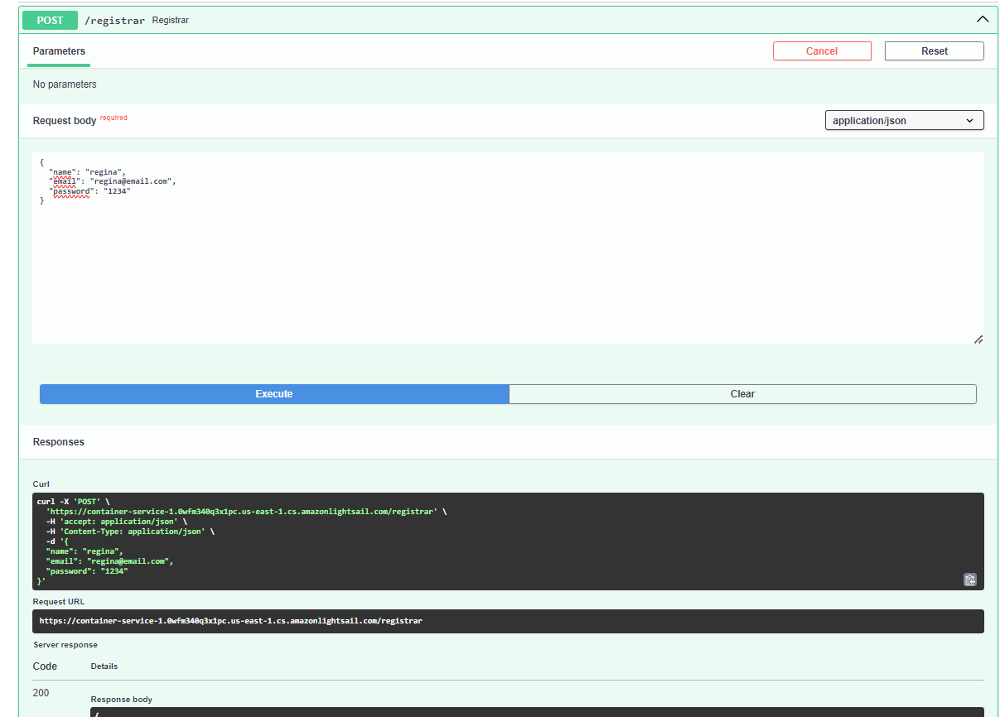

---

### 2. Login

**Login bem-sucedido:**

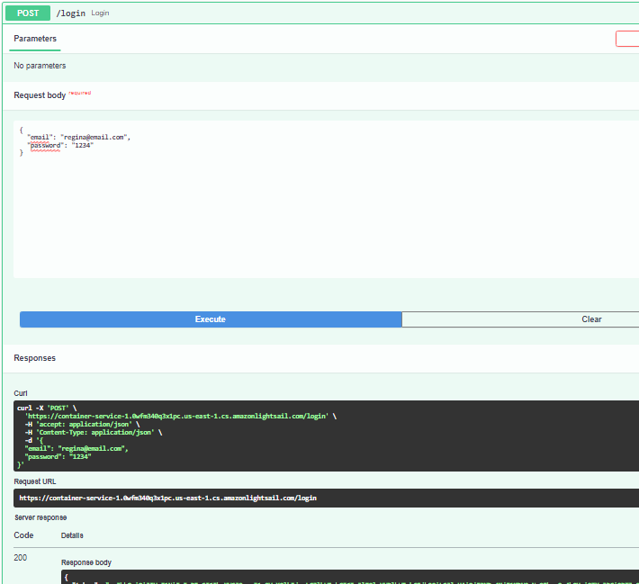

**Tentativa de login inválido (usuário não cadastrado ou senha errada):**

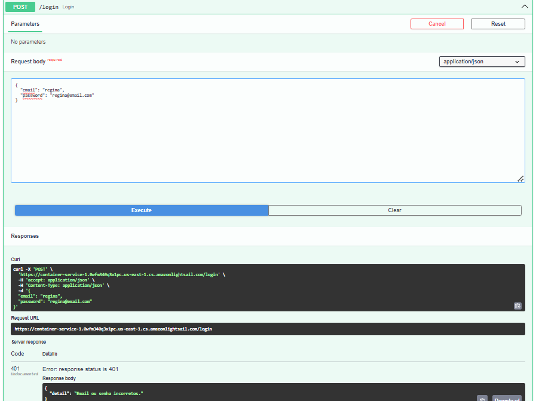

---

### 3. Consulta (`/consultar` com token JWT)

**Token no Header:**

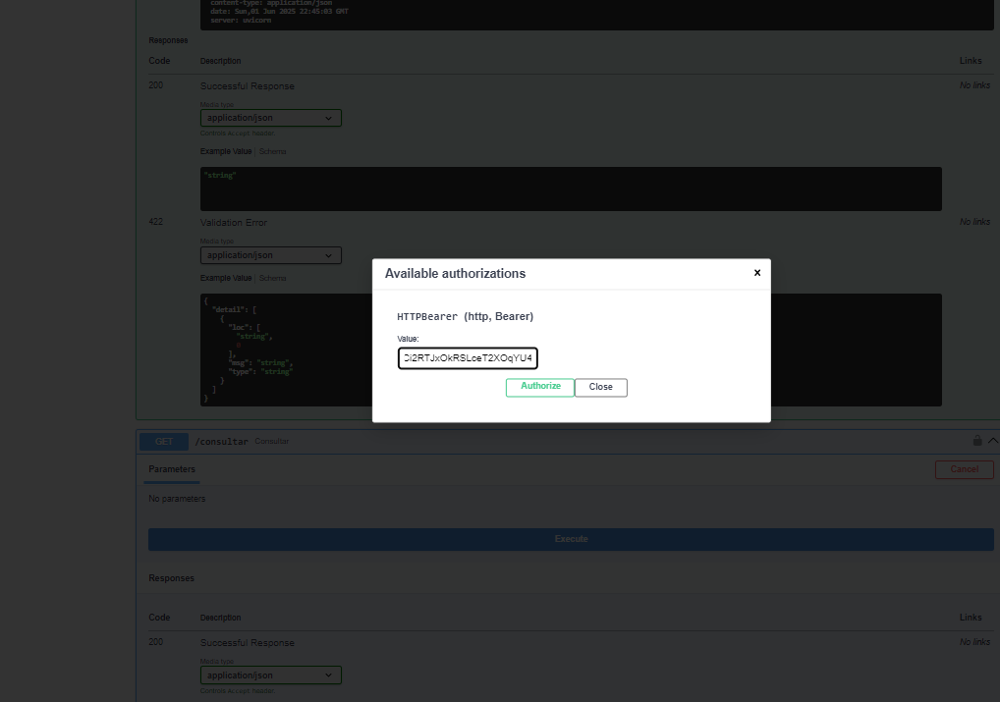

**Resposta com dados do scrap:**

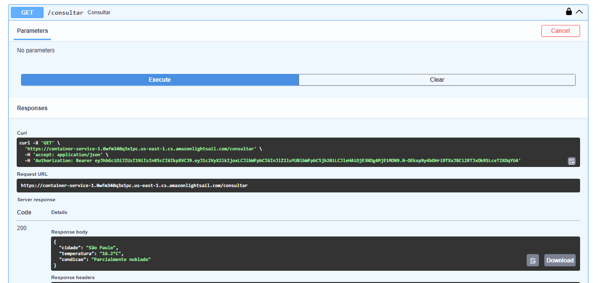

---

### 4. Health-check (`/health-check`)

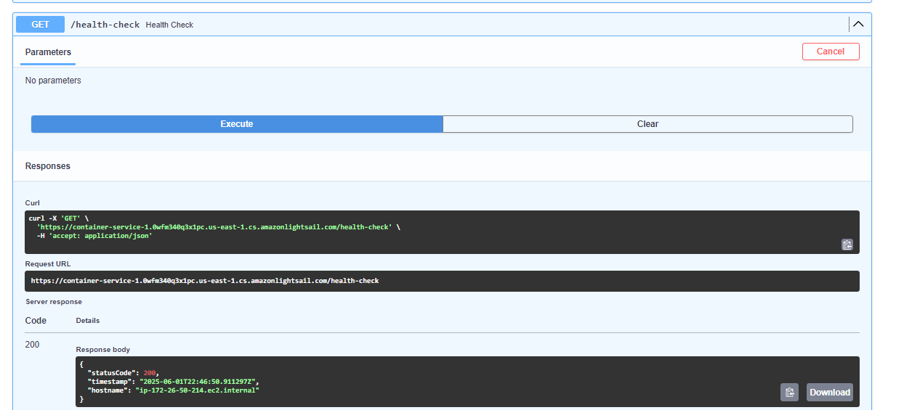


* [ ] Painel do AWS Lightsail com container ativo
* [ ] Banco de dados configurado
* [ ] Tela com custo atual da AWS

---

## 5. Implantação na AWS

### a) Variáveis de ambiente do container e imagem utilizada

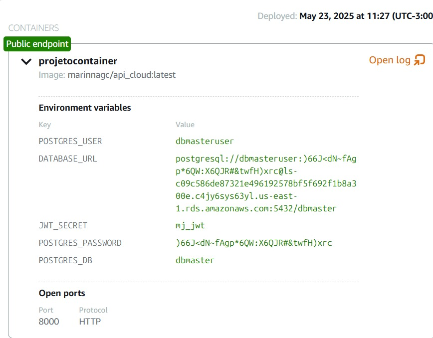

---

### b) Plano do container no AWS Lightsail

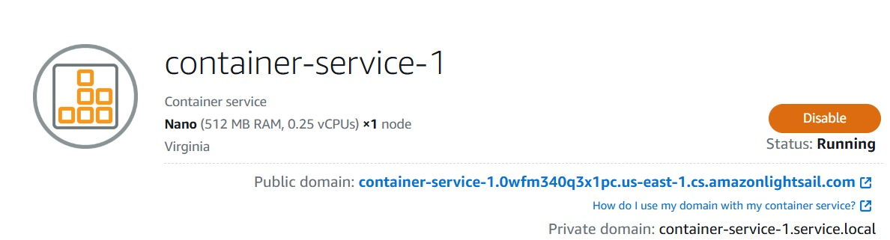

---

### c) Informações da instância de banco de dados gerenciado (PostgreSQL)

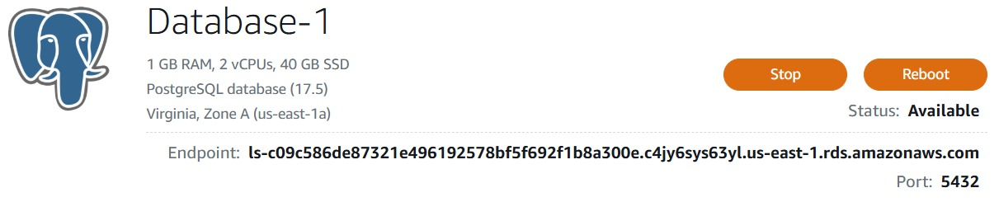

---

### d) Detalhes de conexão do banco (usuário, endpoint e porta)

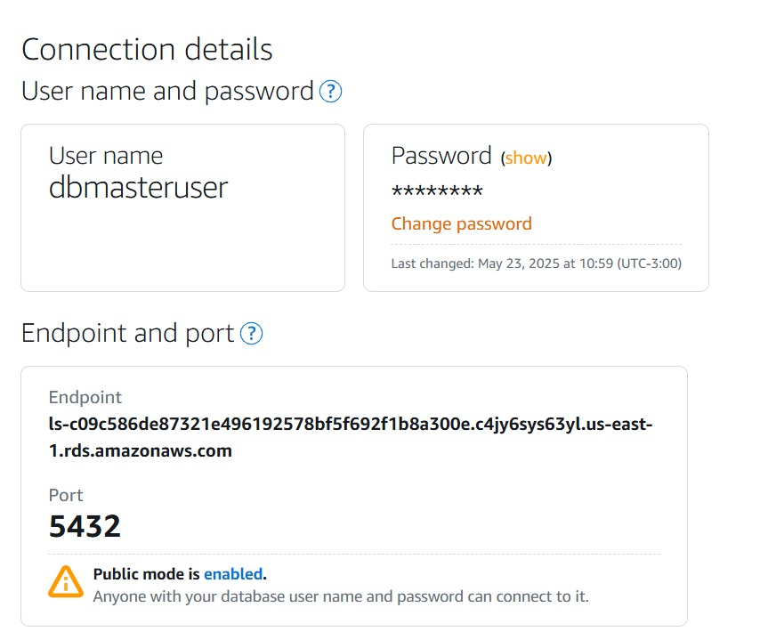

---

### e) API pública rodando na nuvem (interface Swagger)

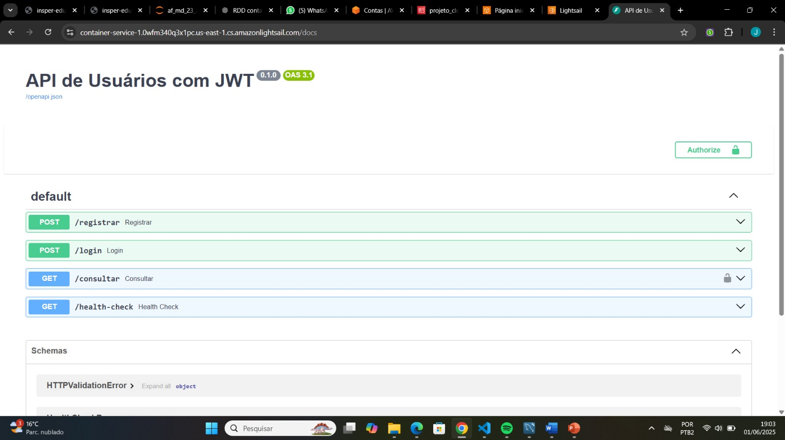

---

### Vídeo de Demonstração

🔗 Link para o vídeo: https://youtu.be/i6KeJAUAcUM

---

## Arquitetura Final do Projeto

A arquitetura do projeto foi desenhada de forma simples e eficiente, utilizando dois principais componentes implantados via **AWS Lightsail**:

1. **Container de aplicação**
   - Responsável por hospedar a API desenvolvida com FastAPI
   - Publicado como imagem no Docker Hub (`marinnagc/api_cloud:latest`)
   - Expõe os endpoints para o cliente via domínio público da AWS
   - Acessa o banco de dados através de uma `DATABASE_URL` segura

2. **Banco de dados gerenciado**
   - Serviço PostgreSQL fornecido pelo Lightsail
   - Configurado com acesso público para a API
   - Protegido por usuário e senha e restrito à aplicação

### Componentes e Comunicação

- **App (FastAPI)**: roda dentro do container
- **Container**: gerenciado no Lightsail, com domínio público
- **Banco de dados PostgreSQL**: instância separada, também no Lightsail
- **Rede**: comunicação direta da API com o banco via internet, com uso de variáveis de ambiente
- **Domínio público**: fornecido automaticamente pelo Lightsail, utilizado para acesso externo

### Diagrama da Arquitetura

```mermaid
flowchart TD
    Usuario[Usuário] -->|Requisições HTTP| Container[Container Lightsail<br>FastAPI]
    Container -->|Conexão TCP| Banco[(Banco de Dados<br>PostgreSQL gerenciado)]
    Container -->|Scraping| Web[Internet (3rd Party Data)]
```