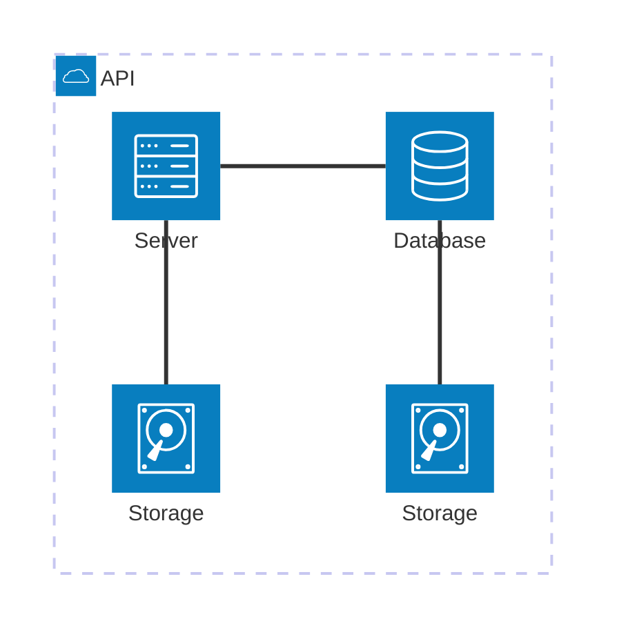

## Objetivo

- Realizar uma experiência prática na configuração e gerenciamento de uma infraestrutura de nuvem bare-metal utilizando o MaaS (Metal as a Service)


- Aprender sobre conceitos básicos de rede de computadores 

## Infra

Os pontos "tarefas" são os passos que devem ser seguidos para a realização do roteiro. Eles devem ser claros e objetivos. Com evidências claras de que foram realizados.

### MAAS

#### Instalando o MAAS:

<!-- termynal -->

``` bash
sudo snap install maas --channel=3.5/Stable
```


/// caption
Dashboard do MAAS
///

Conforme ilustrado acima, a tela inicial do MAAS apresenta um dashboard com informações sobre o estado atual dos servidores gerenciados. O dashboard é composto por diversos painéis, cada um exibindo informações sobre um aspecto específico do ambiente gerenciado. Os painéis podem ser configurados e personalizados de acordo com as necessidades do usuário.

#### Configurando o MAAS

Primeiramente, foi inicializado o MAAS e criado o usuário para o todo o uso futuro, após isso, foi-se criado um par de chaves para autenticação SSH. 
Agora podemos configurar um DNS Forwarder com o DNS do Insper para que podemos usar este DNS para nosso roteador acessar.
Importamos as imagens do Ubuntu para o uso futuro em nossas máquinas, utilizamos das versões Ubuntu 22.04LTS e Ubuntu 20.04 LTS.
Foi feito do upload da chave copiada anteriormente no terminal SSH do MAAS.

#### Chaveando o DHCP

É necessário habilitar o DHCP na subrede do MAAS, para que ele faça a distribuição dos Ip's nas nossas máquinas, foi necessário alterar o **Reserved Range** para **iniciar** em 172.16.11.1 e **acabar** em 172.16.14.255 assim, garantimos que o MAAS não distribua Ip's em uma faixa que já esteja sendo usada pela rede.
Também, foi necessário desabilitar o DHCP que o roteador estava nos fornecendo.


#### Comissionamento 

Com o MasAddress de cada máquina, fizemos o comissionamento da máquina main, roteador e outros 4 servers, esse comissionamento é feito de form automática realizando o boot via PXE na rede. Após verificar se as espefificações de máquina estavam de acordo, seguimos com os próximos passos.

### Acesso Remoto

O acesso remoto é uma parte essencial para a realização do projeto, visto que, sem ele, seria necessário estar fisicamente presente no laboratório e conectar-se diretamente ao servidor por meio de um cabo de rede. Para possibilitar a conexão externa a partir da rede Wi-Fi do Insper, foi configurado um Network Address Translation (NAT) no roteador do kit, permitindo o redirecionamento de requisições externas para a porta 22 (SSH) do servidor principal, denominado MAIN.


Dessa forma, com a configuração do NAT e a liberação do gerenciamento remoto, foi possível acessar o servidor MAIN externamente, porém com a necessidade de estar conectado na rede do Insper, assim, garantindo maior flexibilidade no desenvolvimento e na execução do projeto.

## App
### Django em Nuvem


### Tarefa 1

### Tarefa 2

Exemplo de diagrama



[Mermaid](https://mermaid.js.org/syntax/architecture.html){:target="_blank"}

## Questionário, Projeto ou Plano

Esse seção deve ser preenchida apenas se houver demanda do roteiro.

## Discussões

Quais as dificuldades encontradas? O que foi mais fácil? O que foi mais difícil?

## Conclusão

O que foi possível concluir com a realização do roteiro?
