# **Roteiro 1: MAAS**

## Objetivo

- Realizar uma experiência prática na configuração e gerenciamento de uma infraestrutura de nuvem bare-metal utilizando o MaaS (Metal as a Service)


- Aprender sobre conceitos básicos de rede de computadores 

## Infra

Os pontos "tarefas" são os passos que devem ser seguidos para a realização do roteiro. Eles devem ser claros e objetivos. Com evidências claras de que foram realizados.

### MAAS

#### Instalando o MAAS:

<!-- termynal -->

``` bash
sudo snap install maas --channel=3.5/Stable
```


/// caption
Dashboard do MAAS
///

Conforme ilustrado acima, a tela inicial do MAAS apresenta um dashboard com informações sobre o estado atual dos servidores gerenciados. O dashboard é composto por diversos painéis, cada um exibindo informações sobre um aspecto específico do ambiente gerenciado. Os painéis podem ser configurados e personalizados de acordo com as necessidades do usuário.

#### Configurando o MAAS

Primeiramente, foi inicializado o MAAS e criado o usuário para o todo o uso futuro, após isso, foi-se criado um par de chaves para autenticação SSH. 
Agora podemos configurar um DNS Forwarder com o DNS do Insper para que podemos usar este DNS para nosso roteador acessar.
Importamos as imagens do Ubuntu para o uso futuro em nossas máquinas, utilizamos das versões Ubuntu 22.04LTS e Ubuntu 20.04 LTS.
Foi feito do upload da chave copiada anteriormente no terminal SSH do MAAS.

#### Chaveando o DHCP

É necessário habilitar o DHCP na subrede do MAAS, para que ele faça a distribuição dos Ip's nas nossas máquinas, foi necessário alterar o **Reserved Range** para **iniciar** em 172.16.11.1 e **acabar** em 172.16.14.255 assim, garantimos que o MAAS não distribua Ip's em uma faixa que já esteja sendo usada pela rede.
Também, foi necessário desabilitar o DHCP que o roteador estava nos fornecendo.


#### Comissionamento 

Com o MasAddress de cada máquina, fizemos o comissionamento da máquina main, roteador e outros 4 servers, esse comissionamento é feito de form automática realizando o boot via PXE na rede. Após verificar se as espefificações de máquina estavam de acordo, seguimos com os próximos passos.

### Acesso Remoto

O acesso remoto é uma parte essencial para a realização do projeto, visto que, sem ele, seria necessário estar fisicamente presente no laboratório e conectar-se diretamente ao servidor por meio de um cabo de rede. Para possibilitar a conexão externa a partir da rede Wi-Fi do Insper, foi configurado um Network Address Translation (NAT) no roteador do kit, permitindo o redirecionamento de requisições externas para a porta 22 (SSH) do servidor principal, denominado MAIN.


Dessa forma, com a configuração do NAT e a liberação do gerenciamento remoto, foi possível acessar o servidor MAIN externamente, porém com a necessidade de estar conectado na rede do Insper, assim, garantindo maior flexibilidade no desenvolvimento e na execução do projeto.

## App
### Django em Nuvem

#### Banco de Dados - PostgreSQL no Server1
Para que a aplicação Django funcionasse corretamente em nossa infraestrutura bare-metal, foi necessário primeiramente configurar o banco de dados PostgreSQL, que servirá como backend compartilhado entre os servidores de aplicação.

#### Instalação e configuração

Para essa tarefa, realizamos o deploy do sistema Ubuntu 22.04 no server1 utilizando o MAAS

Após o deploy, acessamos o servidor remotamente via SSH e seguimos com a instalação do PostgreSQL:

``` bash
sudo apt update
sudo apt install postgresql postgresql-contrib -y
```

Em seguida, foi criado um usuário e nosso banco de dados, após isso, realizamos as configurações necessárias e liberamos a porta utilizada pelo postgres.

``` bash
sudo ufw allow 5432/tcp
```

#### Tarefa 1
1. Funcionando e seu Status está como "Ativo" para o Sistema Operacional
2. Acessivel na própria maquina na qual ele foi implantado.
3. Acessivel a partir de uma conexão vinda da máquina MAIN.
4. Em qual porta este serviço está funcionando.

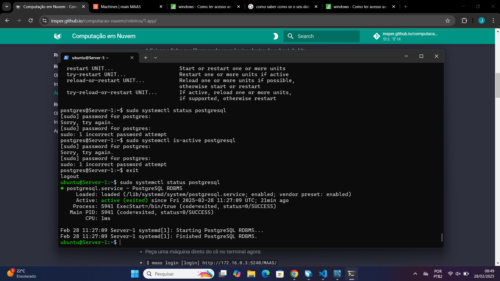
/// caption
Banco como Ativo
///

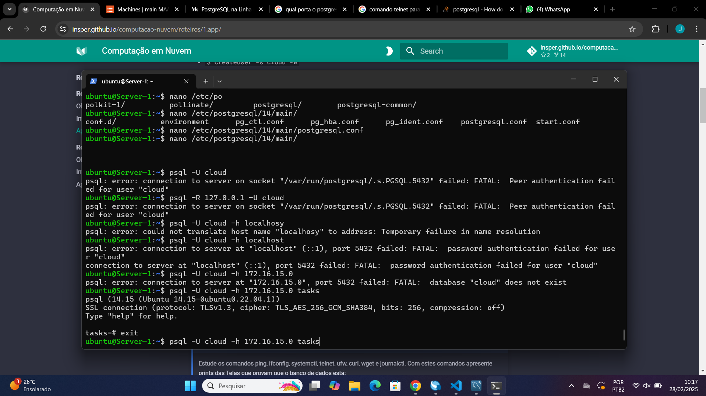
/// caption
Acessivel na própria maquina
///

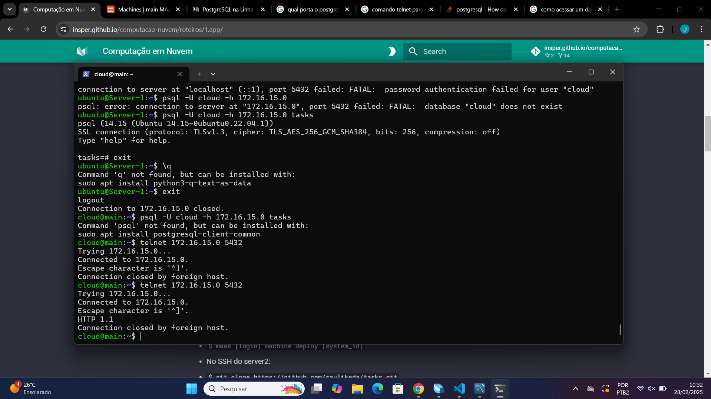
/// caption
Acessivel da MAIN
///

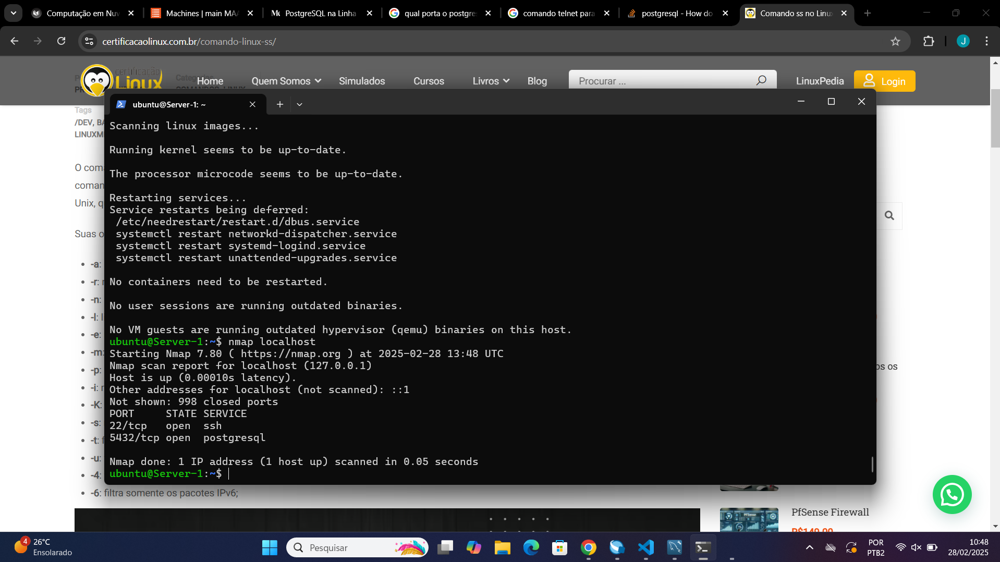
/// caption
Porta que está rodando o serviço
///
### Aplicação Django

Agora, precisamos subir a aplicação Django para nosso MAAS, para isso, vamos precisar "pedir" uma máquina, e vamos fazer isso atravez do cli.

``` bash
maas login [login] http://172.16.0.3:5240/MAAS/
```
Em que [login] é substituido pelo usuário do MAAS.

Foi feito a reserva de nossa máquina denominada "server2", logo, para acessar o serviço do Django fora desta máquina, foi necessário realizar um tunel SSH, que conectou a porta 8080 do server2 para a 8001 no localhost do computador.

``` bash
ssh cloud@10.103.0.X -L 8001:[IP server2]:8080
```

#### Tarefa 2

1. Do Dashboard do **MAAS** com as máquinas.
2. Da aba images, com as imagens sincronizadas.
3. Da Aba de cada maquina(5x) mostrando os testes de hardware e commissioning com Status "OK"

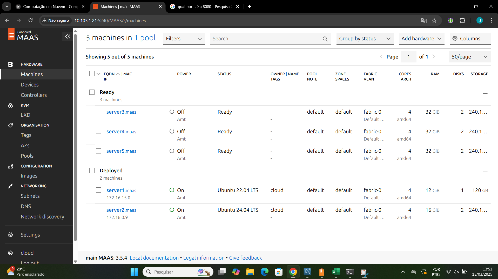
/// caption
Dashboard do MAAS
///

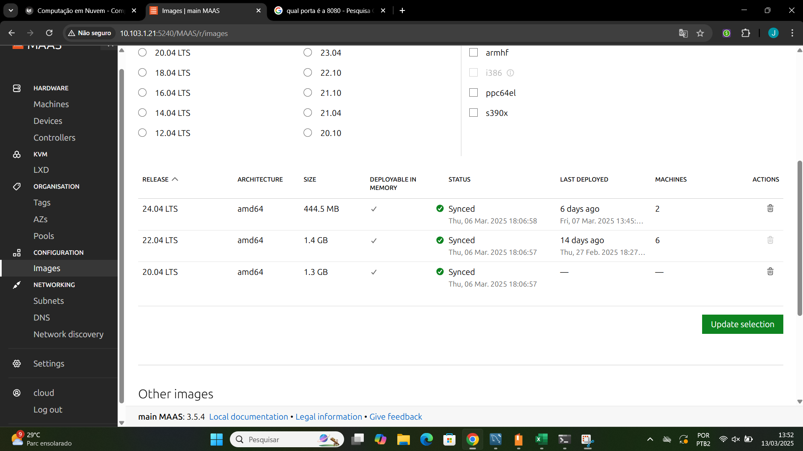
/// caption
Aba images
///


/// caption
Máquina 1
///


/// caption
Máquina 2
///

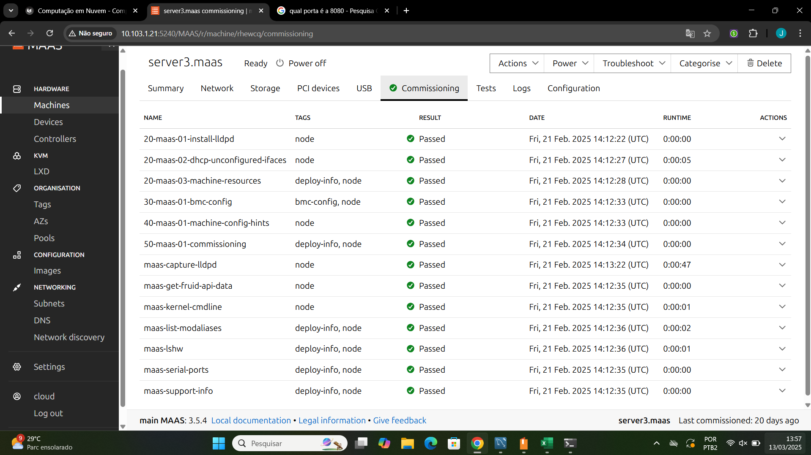
/// caption
Máquina 3
///

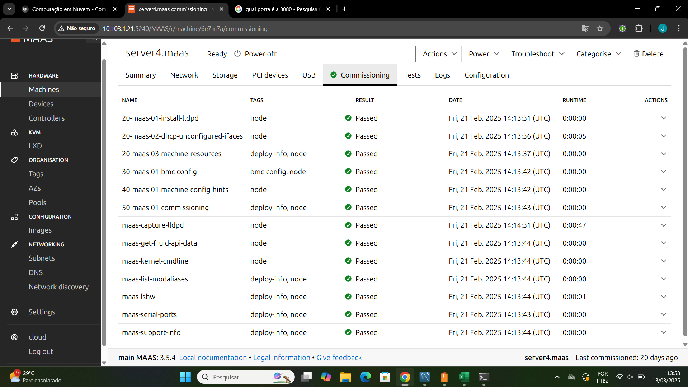
/// caption
Máquina 4
///


/// caption
Máquina 5
///

### Uso do Ansible

#### Tarefa 3

1. De um print da tela do Dashboard do MAAS com as 2 Maquinas e seus respectivos IPs.
2. De um print da aplicacao Django, provando que voce está conectado ao server
3. Explique como foi feita a implementacao manual da aplicacao Django e banco de dados.

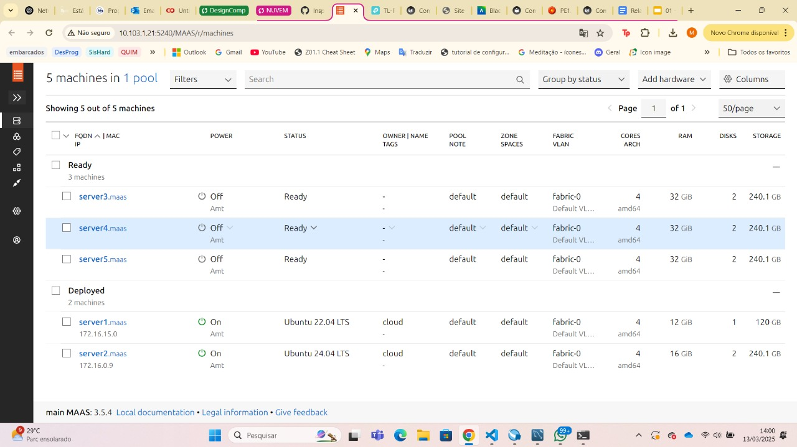
/// caption
Dashboard do MAAS com as 2 Maquinas e seus respectivos IPs
///

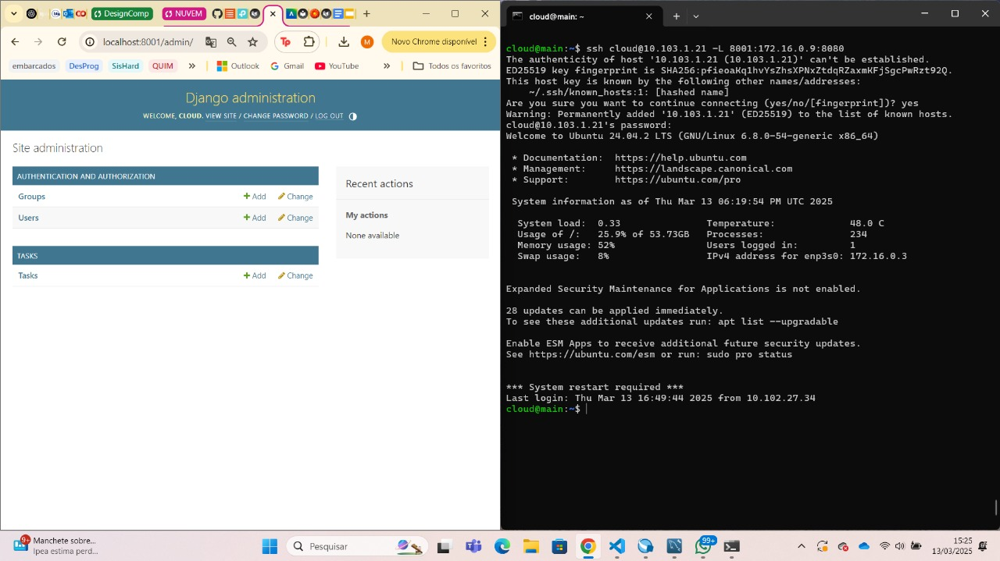
/// caption
Aplicação Django
///

A aplicação Django foi implementada manualmente em uma máquina provisionada pelo MaaS. Após instalar as dependências (como Python, pip e PostgreSQL), foi configurado um ambiente virtual e instalado o Django com as bibliotecas necessárias. Um banco de dados PostgreSQL foi criado e integrado à aplicação por meio do arquivo de configurações. As migrações foram aplicadas e um superusuário foi criado. Por fim, a aplicação foi executada na porta 8080.

### Utilizando Ansible

Agora passamos a utilizar duas instâncias da aplicação Django (server2 e server3) conectadas ao mesmo banco de dados (em server1). Isso permite alta disponibilidade e balanceamento de carga. Para facilitar a instalação automatizada em múltiplos servidores, foi utilizado o Ansible, que permite gerenciar várias máquinas de forma idempotente e eficiente. Com um playbook, foi possível configurar rapidamente o server3 com a mesma aplicação já implantada no server2.

#### Tarefa 4

1. De um print da tela do Dashboard do MAAS com as 3 Maquinas e seus respectivos IPs.
2. De um print da aplicacao Django, provando que voce está conectado ao server2 
3. De um print da aplicacao Django, provando que voce está conectado ao server3 
4. Explique qual diferenca entre instalar manualmente a aplicacao Django e utilizando o Ansible.

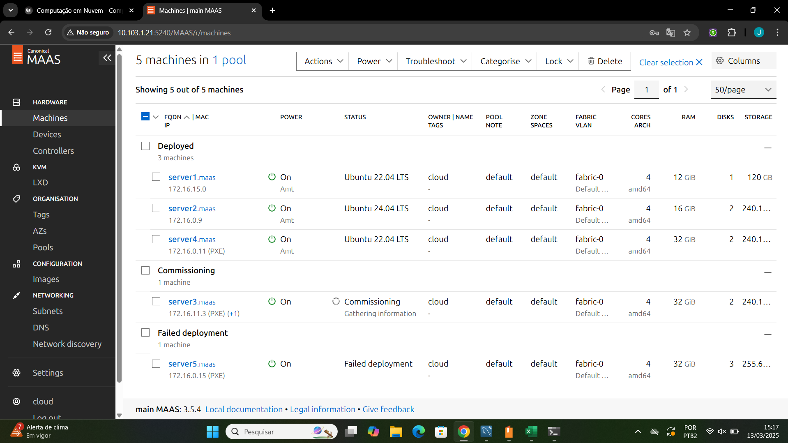
/// caption
Dashboard MAAS
///


/// caption
Aplicação Django conectado no server2
///

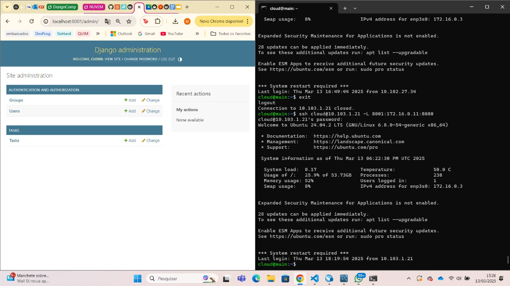
/// caption
Aplicação Django conectado no server3
///

A diferença está principalmente na automação e consistência:

Instalação manual: Você executa os passos (instala pacotes, configura arquivos etc.) manualmente em cada servidor. Se precisar instalar em vários servidores, precisa repetir todos os passos um a um, sujeito a erros humanos e inconsistências.

Instalação via Ansible: Você escreve um playbook que descreve de forma declarativa tudo o que precisa para instalar e configurar a aplicação (pacotes, arquivos, permissões etc.). O Ansible então roda esse playbook em múltiplos servidores simultaneamente, garantindo que todos fiquem exatamente no mesmo estado. Ele é idempotente, ou seja, se você rodar o playbook várias vezes, não vai “quebrar” ou refazer desnecessariamente o que já está pronto. Isso facilita muito quando se precisa gerenciar diversos servidores.

### Balancamento de carga usando Proxy Reverso

O balanceamento de carga com proxy reverso é uma técnica que melhora a disponibilidade e o desempenho de aplicações web. Em vez dos usuários acessarem diretamente os servidores que rodam a aplicação Django (como server2 e server3), eles se conectam a um único ponto de entrada — o proxy reverso, instalado no server4.

Esse proxy (geralmente usando o NGINX) recebe as requisições dos usuários e as distribui entre os servidores disponíveis, conforme a carga. Isso traz duas grandes vantagens:

- Alta disponibilidade: se um dos servidores cair, o outro continua atendendo.

- Desempenho otimizado: o tráfego é dividido, evitando sobrecarga em um único servidor.

Essa arquitetura centraliza o acesso e torna o sistema mais robusto, escalável e resiliente a falhas.

#### Tarefa 5

1. De um print da tela do Dashboard do MAAS com as 4 Maquinas e seus respectivos IPs.
2. Altere o conteúdo da mensagem contida na função `index` do arquivo `tasks/views.py` de cada server para distinguir ambos os servers. 
3. Faça um `GET request` para o path que voce criou em urls.py para o Nginx e tire 2 prints das respostas de cada request, provando que voce está conectado ao server 4, que é o Proxy Reverso e que ele bate cada vez em um server diferente server2 e server3.

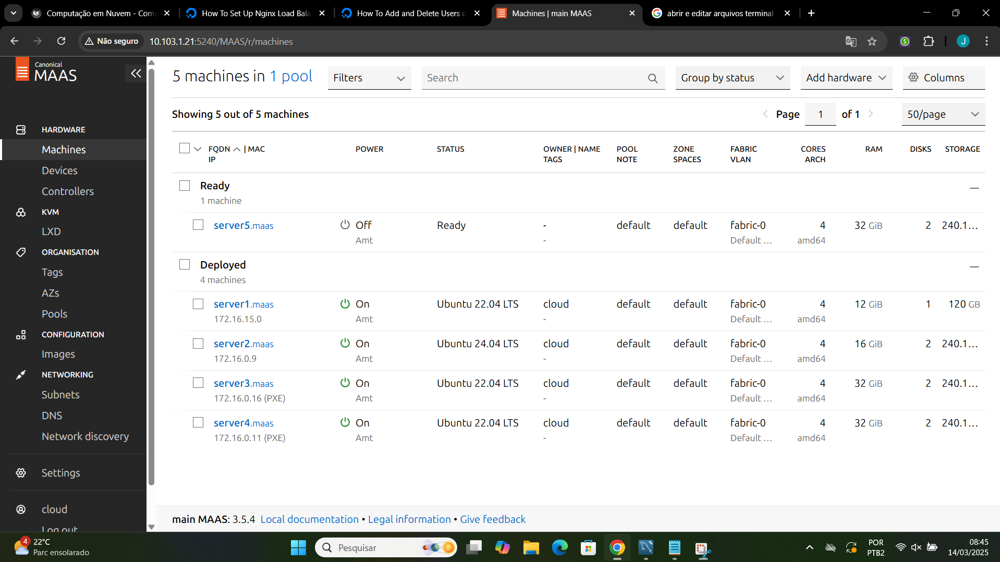
/// caption
Dashboard MAAS
///


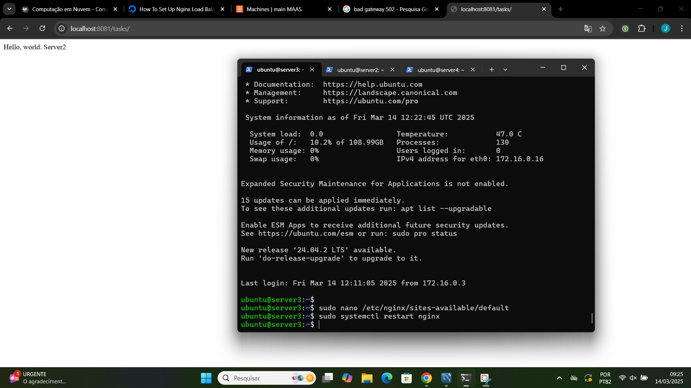
/// caption
Mensagem alterada acessada pelo server2
///


/// caption
Mensagem alterada acessada pelo server4
///
## Discussões

Durante a execução do roteiro, algumas dificuldades técnicas se destacaram. Uma delas foi o entendimento inicial da configuração de redes, principalmente no que diz respeito ao papel do DHCP e da sub-rede gerenciada pelo MAAS. A necessidade de desativar o DHCP do roteador e ajustar corretamente o intervalo reservado para IPs exigiu atenção especial para evitar conflitos de rede.

## Conclusão

A realização deste roteiro permitiu aplicar na prática diversos conceitos essenciais para o gerenciamento de uma infraestrutura em nuvem bare-metal, como o provisionamento automatizado de servidores, o gerenciamento de redes, o acesso remoto seguro, e a implantação de aplicações distribuídas.

O uso do MAAS mostrou-se eficaz para orquestrar os recursos físicos disponíveis, enquanto ferramentas como Ansible e NGINX agregaram valor em automação e escalabilidade. Foi possível comprovar a importância de uma arquitetura distribuída bem planejada, que permita a escalabilidade e mantenha a resiliência do sistema mesmo em caso de falhas individuais.