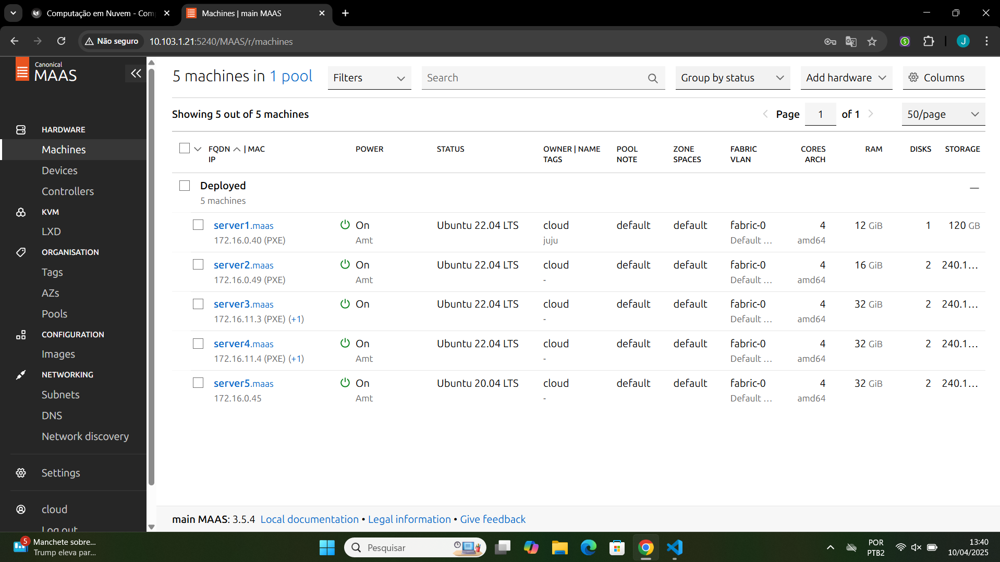
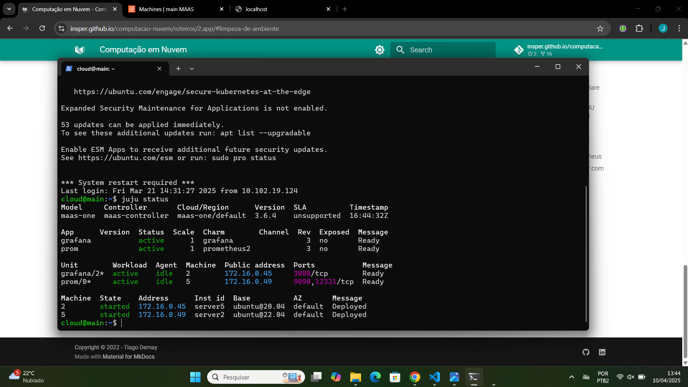
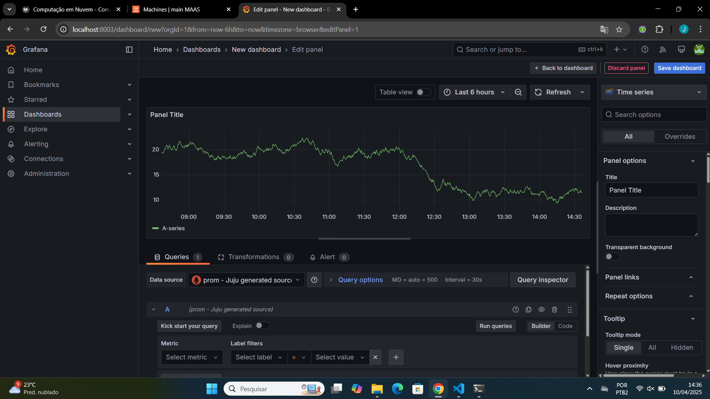
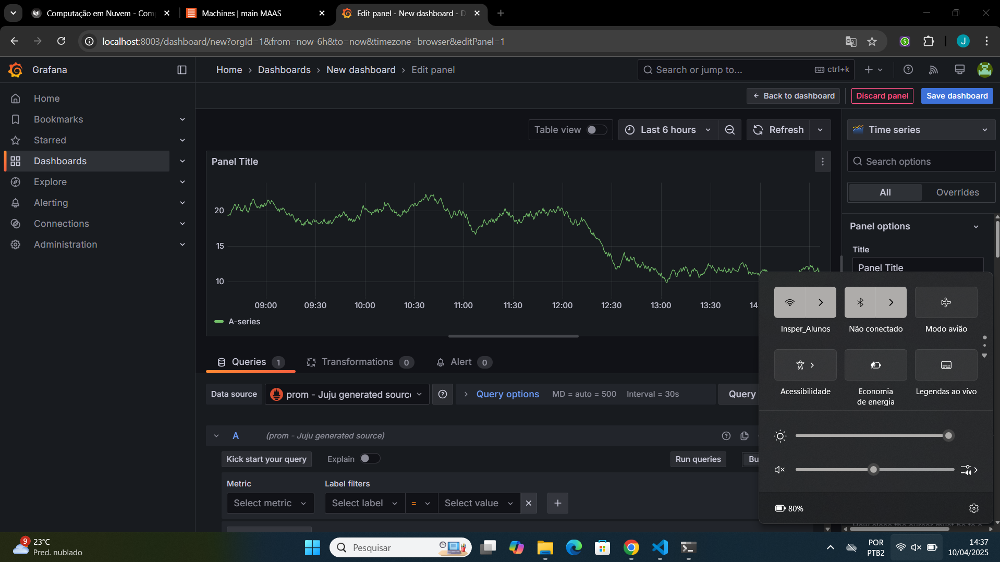
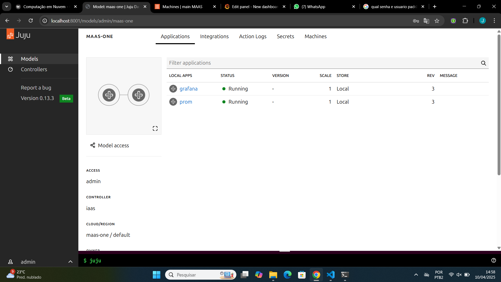

# **Roteiro 2: JUJU**

## **1. Objetivo**

O principal objetivo desta atividade é compreender e aplicar os conceitos de Deployment Orchestration, utilizando a ferramenta Juju para realizar o gerenciamento e a orquestração de aplicações distribuídas sobre uma infraestrutura bare metal, previamente configurada com MAAS. Também é objetivo entender como as aplicações se comunicam entre si, realizando o deploy e a integração de duas ferramentas populares de monitoramento: Prometheus e Grafana.

---

## **2. Infraestrutura**

A infraestrutura foi baseada em uma integração entre MAAS e Juju. Construída com o foco em permitir que o Juju utilizasse o MAAS como seu provedor de recursos físicos e de sistema operacional.

### **2.1 Adicionando o Cluster MAAS como uma Cloud para o Juju**

A primeira etapa foi garantir que o Juju reconhecesse o MAAS como um *cloud provider* (provedor de cloud), ou seja, como uma fonte de máquinas físicas e capacidade de provisionamento. Para isso, criamos um arquivo chamado `maas-cloud.yaml`, com a seguinte estrutura:

```yaml
clouds:
  maas-one:
    type: maas
    auth-types: [oauth1]
    endpoint: http://192.168.0.3:5240/MAAS/
```
Esse arquivo informa ao Juju onde encontrar o servidor MAAS, qual tipo de autenticação usar e que tipo de provedor ele está adicionando.
Com ele, o comando abaixo adicionou o MAAS como uma cloud no Juju:

```bash
juju add-cloud --client -f maas-cloud.yaml maas-one
```

Agora o Juju passou a enxergar o MAAS como uma "nuvem privada", podendo requisitar máquinas quando necessário.

### **2.2 Adicionando as credenciais do MAAS ao Juju**

Como toda integração precisa de autorização, a próxima etapa foi criar o arquivo `maas-creds.yaml`,, contendo as credenciais necessárias para autenticação via API do MAAS , com a chave de autenticação OAuth1 gerada pelo MAAS:

```yaml
credentials:
  maas-one:
    anyuser:
      auth-type: oauth1
      maas-oauth: <API KEY>
```

Essa chave é única para cada usuário MAAS e pode ser copiada no menu do usuário (API Key). Com esse arquivo pronto, rodamos o comando:

```bash
juju add-credential --client -f maas-creds.yaml maas-one
```

Agora o Juju estava apto a interagir com a "cloud" `maas-one`, com permissões reais para alocar, instalar, apagar e monitorar máquinas.

### **2.3 Criação do Controlador**

Para que o Juju pudesse orquestrar os deploys, foi necessário criar um controlador.

O controlador do Juju é como o "cérebro" da operação: ele será responsável por monitorar o estado do cluster, das aplicações, dos modelos, das máquinas e dos serviços. Para criar o controlador:

1. Acessamos o **Dashboard do MAAS**.
2. Escolhemos a máquina `server1` e adicionamos a tag `juju`.
3. Executamos o comando:

```bash
juju bootstrap --bootstrap-series=jammy --constraints tags=juju maas-one maas-controller
```

Esse comando faz com que o Juju reserve a máquina com a tag `juju`, instale o sistema operacional Ubuntu série `jammy`, e configure toda a infraestrutura básica do controlador.

Esse processo leva alguns minutos pois envolve:
- Alocação do hardware físico.
- Provisionamento automático de sistema operacional.
- Instalação dos componentes internos do Juju.
- Sincronização entre Juju e MAAS.


### **2.4 Papel do Controlador Juju**

O **Juju Controller** é uma máquina exclusiva alocada para gerenciar o ciclo de vida das aplicações, armazenar informações de estado, e executar comandos relacionados à orquestração. Todo o restante da configuração e deploy é feito a partir da CLI `juju`, que agora substitui o `maas-cli` nas interações com os serviços em nuvem criados.

---

## **3. Aplicação**

Com a infraestrutura em funcionamento, utilizamos o Juju para orquestrar o deploy de duas aplicações populares em ambientes de monitoramento: **Prometheus** e **Grafana**.

- **Prometheus** é um sistema de monitoramento e banco de dados de séries temporais, ideal para coletar métricas de servidores e aplicações.
- **Grafana** é uma plataforma de visualização que consome dados de diversas fontes (inclusive Prometheus) e apresenta gráficos e painéis interativos para facilitar o entendimento e o diagnóstico do sistema.


### **3.1 Instalação do Dashboard do Juju**

Instalamos o **Dashboard do Juju**, que é uma interface gráfica acessível via navegador, que exibe:
- As clouds configuradas.
- Os modelos de aplicações.
- O estado das máquinas e serviços.
- Os logs e métricas de cada unidade.

Esse dashboard é essencial para validação visual. Além disso, permite gerenciamento simplificado para quem não quer usar apenas a linha de comando.


### **3.2 Deploy da aplicação Grafana e Prometheus**

Para preparar o ambiemte, criamos uma pasta para armazenar os charms (pacotes que o Juju usa para instalar e configurar aplicações), e em seguida fizemos o download dos mesmos.

```bash
mkdir -p /home/cloud/charms
cd /home/cloud/charms
```

```bash
juju download grafana
juju download prometheus2
```

Pacotes do [CharmHub](https://charmhub.io), contendo scripts e metadados necessários para instalação das aplicações.


### **3.3 Deploy com o Juju**

Realizamos o deploy local dos charms baixados:

```bash
juju deploy ./prometheus2_*.charm
juju deploy ./grafana_*.charm
```

Durante o deploy, utilizamos o comando:

```bash
watch -n 1 juju status
```

Esse comando atualiza em tempo real o status de cada unidade implantada, facilitando o acompanhamento do progresso e a identificação de possíveis erros.


### **3.4 Integração do Grafana com Prometheus**

Uma vez que ambas as aplicações estavam ativas, fizemos a integração com base na documentação oficial dos charms:

1. **Acessamos o dashboard do Grafana** pelo navegador, usando o IP da máquina onde ele foi instalado.
2. **Adicionamos o Prometheus como fonte de dados**, informando o endpoint padrão do serviço.
3. **Criamos um painel de exemplo**, com um gráfico que consome dados do Prometheus (por exemplo, uso de CPU ou memória).

Essa etapa confirmou que a comunicação entre os serviços estava correta e que o Grafana era capaz de interpretar as métricas fornecidas.

---

!!! info "Tarefa-1"

    1. 📸 Dê um print da tela do **Dashboard do MAAS** com as máquinas e seus respectivos IPs.  
    2. 📸 Dê um print de tela do comando `juju status` depois que o **Grafana** estiver com status `"active"`.  
    3. 📸 Dê um print da tela do **Dashboard do Grafana** com o **Prometheus** aparecendo como fonte de dados (*source*).  
    4. 🌐 Prove (com print) que você está conseguindo acessar o **Dashboard** a partir da rede do **Insper**.  
    5. 🧩 Dê um print na tela que mostra as **aplicações sendo gerenciadas pelo JUJU**  
       (ex: [http://IP-Serviço:8080/models/admin/maas](http://IP-Serviço:8080/models/admin/maas))


## Tarefa 1.1


## Tarefa 1.2


## Tarefa 1.3


## Tarefa 1.4


## Tarefa 1.5


---