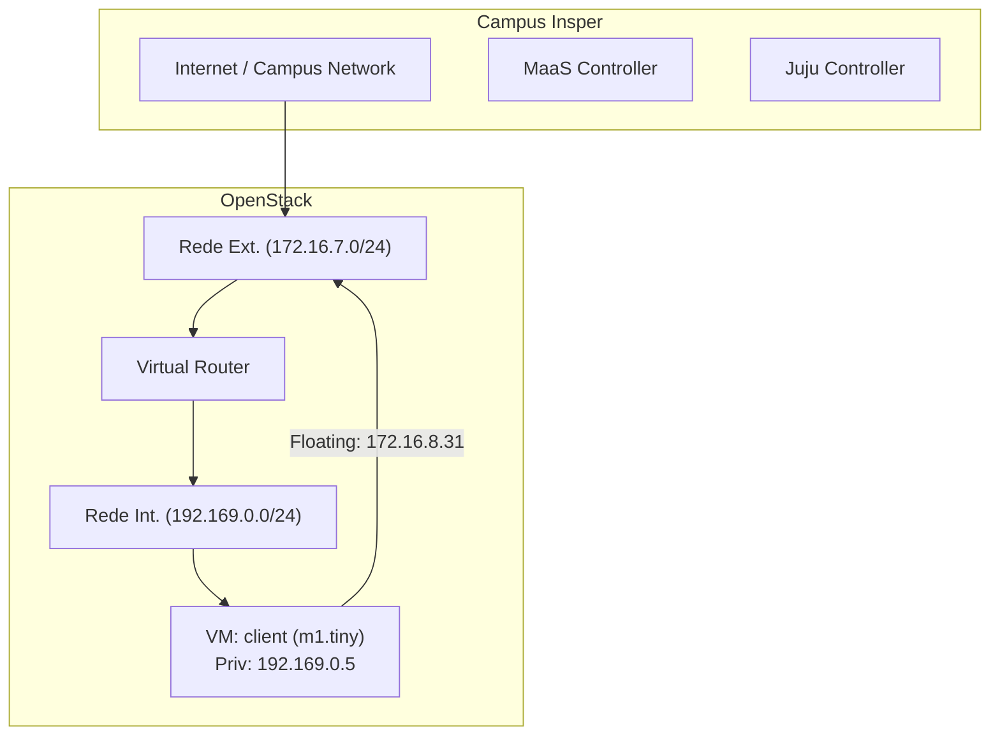

# **Roteiro 3: Openstack**

## **Explicação dos deploys** 

### 1. Instalando o Juju Controller
Prepara uma máquina dedicada (server1) para ser o controlador Juju, que orquestrará todos os deployments de charms no ambiente MAAS. 

### 2. Definindo o modelo de deploy
Cria e seleciona um modelo chamado openstack no Juju, definindo a série padrão (jammy) para todo o deploy. Isso isola o ambiente OpenStack em um espaço de trabalho próprio. 

### 3. Ceph OSD
Implanta três unidades do charm ceph-osd nos nós de compute, configurando-os para usar /dev/sda e /dev/sdb como dispositivos de armazenamento. Esses OSDs (Object Storage Daemons) serão responsáveis por armazenar os dados em blocos do cluster Ceph. 

### 4. Nova Compute
Instala o charm nova-compute em cada nó de compute (máquinas 0, 1 e 2), transformando-os em hipervisores QEMU capazes de executar instâncias de máquinas virtuais. Habilita live-migration e resize para mobilidade e escalabilidade das VMs. 

### 5. MySQL InnoDB Cluster
Desdobra três réplicas do charm mysql-innodb-cluster em containers LXD, criando um cluster de banco de dados altamente disponível que servirá como backend de dados para todos os serviços OpenStack. 

### 6. Vault
Utiliza o charm vault num container LXD (machine 2) para gerenciar certificados TLS e segredos. Em seguida, usa o charm mysql-router para relacionar o Vault ao cluster MySQL, garantindo comunicação segura entre serviços. 

### 7. Neutron Networking
Implanta quatro charms — neutron-api, neutron-api-plugin-ovn (subordinate), ovn-central e ovn-chassis — para prover a camada de rede virtual (flat e overlay) às VMs. Configura mappings entre pontes OVS e interfaces físicas e adiciona todas as relações necessárias, inclusive com o Vault e o banco de dados. 

### 8. Keystone
Instala o charm keystone (serviço de identidade) e o relaciona ao cluster MySQL e ao Neutron para autenticação unificada dos usuários e serviços. 

### 9. RabbitMQ
Utiliza o rabbitmq-server como broker AMQP, adicionando relações com o Neutron e o Nova Compute para fila de mensagens entre componentes distribuídos. 

### 10. Nova Cloud Controller
Instala o nova-cloud-controller (inclui scheduler, API e conductor) na máquina 2, juntando-o ao banco de dados, ao Keystone, ao RabbitMQ, ao Neutron e ao Nova Compute para orquestrar pedidos de criação e gerenciamento de VMs. 

### 11. Placement
Desdobra o placement API na máquina 2 e relaciona-o ao MySQL e ao Nova Cloud Controller, permitindo o rastreamento da disponibilidade de recursos (CPU, RAM, disco) para alocação de instâncias. 

### 12. Horizon – OpenStack Dashboard
Instala o openstack-dashboard (Horizon) para fornecer uma interface web de gerenciamento. É conectado ao Keystone, ao MySQL e ao Vault para autenticação, armazenamento e TLS. 

### 13. Glance
Implanta o glance (serviço de imagens) na máquina 2, relacionando-o ao banco de dados, ao Nova Compute e ao Keystone, para armazenar e servir imagens de disco das VMs. 

### 14. Ceph Monitor
Desdobra três unidades do ceph-mon para manter o mapa de cluster Ceph e garantir consistência. Relaciona-se aos OSDs, ao Nova Compute e ao Glance para fornecer backend de armazenamento via RBD. 

### 15. Cinder
Instala o cinder (block storage service) na máquina 1 e o cinder-ceph (subordinate) para usar o Ceph como backend de volumes persistentes. Relaciona-se também ao Nova Cloud Controller, ao Keystone, ao RabbitMQ e ao Glance. 

### 16. Ceph RADOS Gateway
Utiliza o ceph-radosgw na máquina 0, criando um gateway HTTP compatível com S3/Swift para oferecer armazenamento de objetos separado do Swift nativo. Relaciona-se ao cluster de Monitores Ceph. 

### 17. Ceph-OSD Integration
Ajusta a configuração de dispositivos do ceph-osd para /dev/sdb, integrando por completo os OSDs após garantir que todos os passos anteriores foram concluídos sem erros. 

## **Como os componentes se conectam**
Todos os serviços são integrados via relações Juju, que automaticamente criam e gerenciam canais de comunicação entre charms:

### Banco de dados (MySQL)
Cada serviço que precisa de persistência (Keystone, Nova, Neutron, Glance, Cinder, Horizon, Placement, Vault) é relacionado ao cluster MySQL via mysql-router;

### Secret Management (Vault) 
Fornece certificados TLS a todos os serviços que exigem comunicação segura, via vault:certificates;

### Mensageria (RabbitMQ) 
Broker AMQP ligado a Neutron e Nova Compute para filas de trabalho e eventos;

### Identidade (Keystone) 
Autenticador único, integrado a Neutron, Nova Cloud Controller e Horizon via identity-service;

### Armazenamento (Ceph)
OSDs e Monitores formam o backend distribuído; Nova Compute, Glance e Cinder consomem esse armazenamento via relações ceph:client, ceph-access e storage-backend;

### Rede (Neutron/OVN) 
Neutron API, Central, Chassis e plugin OVN estruturam as redes flat e overlay, relacionando-se ao Nova Compute para vincular interfaces de VMs;

### Dashboard (Horizon)
Consome Keystone para login e MySQL para dados administrativos.

## **SetUp**

### 1. Autenticação com Keystone

* Carregamos o arquivo de credenciais (openrc) em nosso terminal de administração, para assegurar que todos os sentimentos dos serviços (Nova, Cinder, Neutron) seriam invocados com privilégios corretos e para garantir segurança e rastreabilidade das ações.

### 2. Verificação Inicial na Interface Horizon

* Acessamos o painel Horizon como administradores e navegamos pelas seções principais: Compute, Instâncias e Network Topology, para obter uma visão geral do estado atual do ambiente — máquinas provisionadas pelo MaaS e unidades do Juju.

### 3. Preparação de Imagens e Flavors

* Importamos a imagem base do Ubuntu Jammy e criamos quatro perfis de instância (flavors) com diferentes combinações de CPU, memória e disco, isso nos permitiu padronizar os tipos de VMs que seriam instanciadas posteriormente.

### 4. Configuração da Rede Externa

* Definimos uma rede externa e alocamos um pool de endereços na faixa pré-estabelecida (172.16.7.0–172.16.8.255), para conectar as VMs à rede física e possibilitar comunicação com o mundo externo, mantendo o controle de escopo do tráfego de saída.

### 5. Montagem da Rede Interna e Roteador Virtual

* Criamos uma rede privada isolada (192.169.0.0/24) e associamos um roteador virtual que faz o link entre essa rede interna e a externa, para segmentar o tráfego interno das instâncias, garantindo isolamento e flexibilidade de roteamento.

### 6. Importação de Chave SSH e Regras de Segurança

* Carregamos nosso par de chaves SSH (id_rsa.pub) para permitir acessos sem senha e ajustamos o grupo de segurança padrão para autorizar SSH e ICMP. Como o nome do nosso par de chave é padrão utilizamos o comando: 
    ssh ubuntu@172.16.8.31 
Sendo o IP utilizado o nosso Floating IP.

### 7. Teste de Criação de Instância

* Subimos uma VM do tipo m1.tiny chamada `client`, associamos um IP flutuante e validamos acesso SSH desde nossa máquina local, para confirmar que todas as configurações anteriores (imagens, flavors, redes, segurança) estavam corretas e funcionais.

### 8. Escalabilidade dos Nós de Computação e Armazenamento

* Adicionamos unidades de compute e de block storage ao cluster via Juju (nova-compute e ceph-osd) em máquinas reservadas no MaaS, para demonstrar a escalabilidade horizontal do ambiente, aumentando capacidade de processamento e balanceamento de carga.

#### Exemplo de Diagrama (Mermaid)

---
